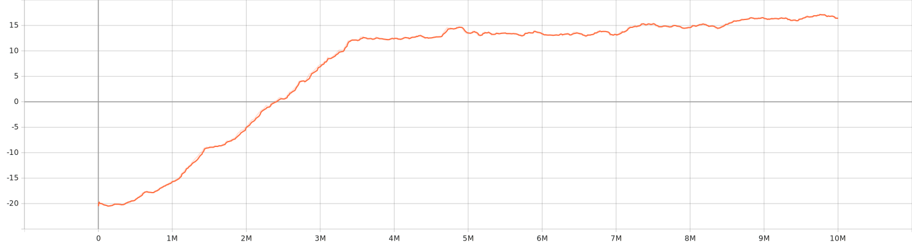
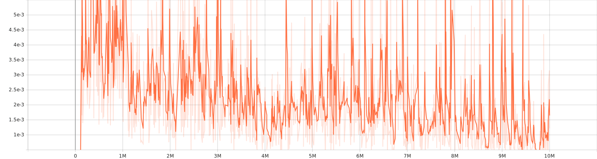

# Experiments result and comparaison

## Hyperparameters

One step in the training process is equivalent to 4 frames in the environment.

| Hyperparameter         | Value      | Description                                                                            |
|------------------------|------------|----------------------------------------------------------------------------------------|
| Optimiser              | Adam       |                                                                                        |
| Learning Rate          | 0.0001     |                                                                                        |
| Loss                   | Smooth L1  |                                                                                        |
| Max timesteps          | 10,000,000 | Agent trained on this number of steps                                                  |
| Target update interval | 1,000      | Number of steps between the synchronisation of the policy and target networks          |
| Learning starts        | 100,000    | Number of steps to wait before we start to optimise the model                          |
| Train frequency        | 4          | Network optimisation is done every `Train frequency` steps                             |
| Replay buffer size     | 10,000     | Size of the experience replay buffer                                                   |
| Batch size             | 32         | Size of minibatch to be used to calculate the expected Q Values and optimise the model |
| Discount rate          | 0.99       | Gamma                                                                                  |
| Exploration fraction   | 0.1        | Fraction of the training steps used for epsilon greedy decay                           |
| Epsilon final          | 0.01       | Minimum exploration value                                                              |
| Frame Stack            | 4          | Number of frames stacked together                                                      |

## CNN Double Deep Q Network

*TODO: Insert video/gif of the agent playing*

For this experiment, I used my implementation of a Double Q Network.

See results in Tensorboard.dev: https://tensorboard.dev/experiment/rGyYHGM7SyyxsGkJ3kPNjw/#scalars
- Training time: 7h 36m.  
A relatively small training time, the agent is capable of learning how to play in the environment in a reasonable amount of time.

### Charts
**Mean reward on last 100 episodes**  
As we can see with CNN, the agent started to converge from ~500,000 steps, with a pretty stable increase until 3.5 millions 
frames where it started to stabilise itself until the end with minimal increases.

<i>Evolution of the mean reward (100 last episodes calculated at each end of episodes). x-Axis: timesteps, y-Axis: reward value</i>

**Loss**  
Evolution of the loss value accros timesteps. As we can see, the loss can still be pretty high at the end of training.

<i>Evolution of the loss x-Axis: timestep, y-Axis: loss value</i>

## Swin Double Deep Q Network