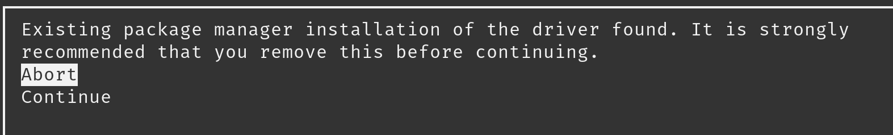
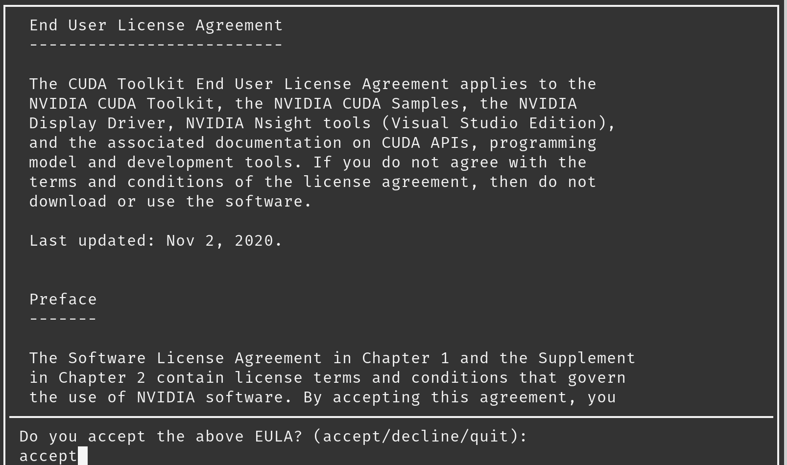

# Installing CUDA 11.2

- **Author:** Adrien Dudon

CUDA 11.2 is an out-of-date version of CUDA and is required to use TensorFlow **2.11.***. Due to this, it is a bit difficult to properly install CUDA, especially using the deb packages, because NVIDIA replaced their old Linux GPG Repository Key and the command and guide are still using the old one. The goal of this guide is to have a better guide than the one from NVIDIA to install CUDA on an Ubuntu-based system (tested on my machine, Pop!_OS 22.04).

We are going to do the install using the distribution-independent package (runfile packages). NVIDIA advises us to use the distribution-dependent package (deb) but it causes many issue, as it tries to install its own version of the NVIDIA driver which is not the latest one.

See this Stack Overflow which gives some good explanation too: [https://askubuntu.com/questions/1247693/issues-while-installing-cuda-10-1-and-nvidia-driver-in-ubuntu-18-04](https://askubuntu.com/questions/1247693/issues-while-installing-cuda-10-1-and-nvidia-driver-in-ubuntu-18-04)

> *Installing CUDA from runfile is much simpler and smoother than installing the NVIDIA driver. It just involves copying files to system directories and has nothing to do with the system kernel or online compilation. Removing CUDA is simply removing the installation directory. So I personally does not recommend adding NVIDIA's repositories and install CUDA via apt-get or other package managers as it will not reduce the complexity of installation or uninstallation but increase the risk of messing up the configurations for repositories.
By:* [Adupa Vasista](https://askubuntu.com/users/1040542/adupa-vasista)
> 

- Official Installation Guide: [https://docs.nvidia.com/cuda/archive/11.2.2/cuda-installation-guide-linux/index.html](https://docs.nvidia.com/cuda/archive/11.2.2/cuda-installation-guide-linux/index.html)
- Runfile package: [https://developer.nvidia.com/cuda-11.2.2-download-archive?target_os=Linux&target_arch=x86_64&target_distro=Ubuntu&target_version=2004&target_type=runfilelocal](https://developer.nvidia.com/cuda-11.2.2-download-archive?target_os=Linux&target_arch=x86_64&target_distro=Ubuntu&target_version=2004&target_type=runfilelocal)
- Inspiration: [https://gist.github.com/wangruohui/df039f0dc434d6486f5d4d098aa52d07#install-cuda](https://gist.github.com/wangruohui/df039f0dc434d6486f5d4d098aa52d07#install-cuda)

We are going to install an older version of the CUDA Toolkit, but we do not want to change the CUDA Runtime that is part of the nVidia driver, so the CUDA Toolkit version will be older than the current runtime version we have installed. It does not matter much, as the CUDA Driver shipped with the Runfile is stale, and nVidia Driver already include a newer CUDA runtime wich is still compatible with CUDA program made with an older version.

# Installation steps

## 1. **Pre-installation Actions**

This is to check that you have the correct hardware (a CUDA-compatible GPU).  This should be the case so you can skip this section if you’re sure.

Follow the pre-installation actions: [https://docs.nvidia.com/cuda/archive/11.2.2/cuda-installation-guide-linux/index.html#pre-installation-actions](https://docs.nvidia.com/cuda/archive/11.2.2/cuda-installation-guide-linux/index.html#pre-installation-actions)

For distro-specific stuff, check the **************Ubuntu************** section.

## 2. Download CUDA Toolkit

> Official step to download and install the Runfile packages (if needed): [https://docs.nvidia.com/cuda/archive/11.2.2/cuda-installation-guide-linux/index.html#runfile](https://docs.nvidia.com/cuda/archive/11.2.2/cuda-installation-guide-linux/index.html#runfile)
> 

---

### Download

Do not install the Nvidia GPG Repository key as we don’t need them because we are using the Runfile.

Download the Runfile: `wget https://developer.download.nvidia.com/compute/cuda/11.2.2/local_installers/cuda_11.2.2_460.32.03_linux.run`

### Disabling Nouveau Drivers

Type this command: `lsmod | grep nouveau`. **If nothing appear, you can ignore this step** **and run the installer.** 

Usually, you don’t have to do that either way if you are using the proprietary Nvidia Driver (which you should do anyways).

*If you have nouveau, disable it: [https://docs.nvidia.com/cuda/archive/11.2.2/cuda-installation-guide-linux/index.html#runfile-nouveau-ubuntu](https://docs.nvidia.com/cuda/archive/11.2.2/cuda-installation-guide-linux/index.html#runfile-nouveau-ubuntu)*

### Install

Run the installer `sudo sh cuda_11.2.2_460.32.03_linux.run` (replace with correct file name if this one does not correspond, importnat part is **************sudo sh**************).

You may need to use the `--override` option if your gcc version is too recent, because this runfile require an older version of gcc to be installed. It does not matter much as we can tell CUDA to use another version of gcc if needed without having to downgrade the version of the system.

**Driver found error**

After we ran the installer, we will have to wait a few seconds before something happens, then the terminal shows us this:



 This error message is normal, that is because we already have a newer version of the nVidia/CUDA drivers in our system, and we do not want to remove it, we just one to install the CUDA Toolkit alongside our current drivers, just press Continue.

**EULA acceptation**

After pressing continue, we are being diaplyed the EULA, type `accept` then press Enter.



> *It is possible that you won’t see the bottom prompt, that is probably because the Terminal has been resized while running the Runfile, or the terminal is not able to display this properly (but it should on Pop!_OS).*
> 

********************************************Select packages to install********************************************

We want to install only the CUDA Toolkit and Samples (useful to test if CUDA is working). So, unselect everything else and press Install.


Wait some time, then we will be displayed a “Result” screen, with the conclusion on the installation. The screen will tell use that the installation is not complete, this is normal, that’s because we did not install the CUDA Driver included with the Runfile.

After the installation is done, if you did not change the default installation directory, this is where you can find the packages.


Source: nVidia

The installed also create a symbolik link for the **`/usr/local/cuda`** folder to point to `**/usr/local/cuda-11.2**`.

### 3. Post-installation Actions

**Install correct gcc version**

To compile program using this version of CUDA (like the examples in the Samples folder), you need a version of gcc that is compatible. The latest version of gcc (and the one shipped with Pop!_OS) is not compatible, so we need to install an older version.

CUDA 11.2 support gcc and g++ until version 10, so install it:

`$ sudo apt install gcc-10 g++-10` 

We then need to tell our CUDA Toolkit that we want to use those specific version of gcc and g++ and not the default one installed on our system. Let’s create a symlink:

```bash
sudo ln -s /usr/bin/gcc-10 /usr/local/cuda-11.2/bin/gcc
sudo ln -s /usr/bin/g++-10 /usr/local/cuda-11.2/bin/g++
```

**********************************Environment setup**********************************

Create the path variable to /usr/local/cuda-11.2/bin.

 `$ export PATH=/usr/local/cuda-11.2/bin${PATH:+:${PATH}}`

You should probably add `usr/local/cuda-11.2/bin` to the PATH variable in `/etc/environment` file for the change to be persistent across shells and sessions. Restart the shell or refresh it (`$ source /etc/environment`).

You can now type: `nvcc --version` to check that the environment variable has been updated and that CUDA has been installed.

In addition, when using the runfile installation method, the `LD_LIBRARY_PATH` variable needs to be set to `/usr/local/cuda-11.2/lib64` on a 64-bit system.

To change the environment variables:

```bash
$ export LD_LIBRARY_PATH=/usr/local/cuda-11.2/lib64\
${LD_LIBRARY_PATH:+:${LD_LIBRARY_PATH}}
```

> Alternatively, you can add `/usr/local/cuda-11.2/lib64` to `/etc/ld.so.conf` and run `ldconfig` as root. So changes are persisted across sessions, and it is cleaner.
> 

### Verify installation

If you want, you can perform the recommended action to verify that the installation was a success.

******************************************************************************Check the persistence deamon is running******************************************************************************

`$ systemctl status nvidia-persistenced`

**************************************Verify installation**************************************

Follow the step in the doc’.

[https://docs.nvidia.com/cuda/archive/11.2.2/cuda-installation-guide-linux/index.html#verify-installation](https://docs.nvidia.com/cuda/archive/11.2.2/cuda-installation-guide-linux/index.html#verify-installation)