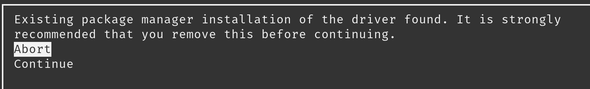
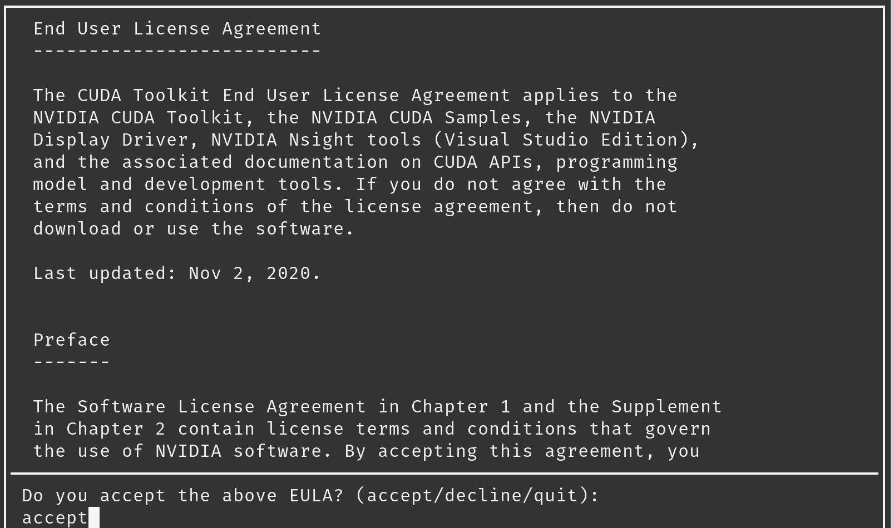
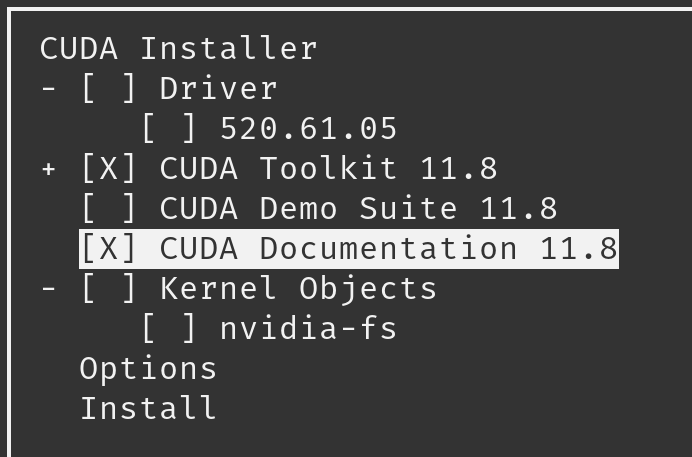

# Installing CUDA 11.8

The goal of this guide is to explain in simple way how to install CUDA on an Ubuntu-based system (tested on my machine, Pop!_OS 22.04). The official guide is a bit hard to follow. CUDA 11.8 is required to install TensorFlow 2.12.

We are going to do the install using the distribution-independent package (runfile packages). NVIDIA advises us to use the distribution-dependent package (deb) but it causes many issue, as it tries to install its own version of the NVIDIA driver which is not the latest one, and you probably have already a recent version installed on your computer.

- Official Installation Guide: [https://docs.nvidia.com/cuda/archive/11.8.0/cuda-installation-guide-linux/index.html](https://docs.nvidia.com/cuda/archive/11.8.0/cuda-installation-guide-linux/index.html)
- Inspiration (CUDA installation wtih Runfile): [https://gist.github.com/wangruohui/df039f0dc434d6486f5d4d098aa52d07#install-cuda](https://gist.github.com/wangruohui/df039f0dc434d6486f5d4d098aa52d07#install-cuda)

# Installation steps

## 1. **Pre-installation Actions**

This is to check that you have the correct hardware (a CUDA-compatible GPU).  This should be the case so you can skip this section if you’re sure.

Follow the pre-installation actions [here](https://docs.nvidia.com/cuda/archive/11.8.0/cuda-installation-guide-linux/index.html#pre-installation-actions). For distro-specific stuff, check the **************Ubuntu************** section.

## 2. Download CUDA Toolkit

> Official step to download and install the Runfile packages (if needed): [https://docs.nvidia.com/cuda/archive/11.8.0/cuda-installation-guide-linux/index.html#runfile](https://docs.nvidia.com/cuda/archive/11.8.0/cuda-installation-guide-linux/index.html#runfile)
> 

---

### Download

Do not install the Nvidia GPG Repository key as we don’t need them because we are using the Runfile.

Download the Runfile 

```bash
wget https://developer.download.nvidia.com/compute/cuda/11.8.0/local_installers/cuda_11.8.0_520.61.05_linux.run
```

### Disabling Nouveau Drivers

Type this command: `lsmod | grep nouveau`. **If nothing appear, you can ignore this step** **and run the installer.** 

Usually, you don’t have to do that  if you are using the proprietary Nvidia Driver (which you should do anyways).

*If you have nouveau, disable it:* [https://docs.nvidia.com/cuda/archive/11.8.0/cuda-installation-guide-linux/index.html#runfile-nouveau](https://docs.nvidia.com/cuda/archive/11.8.0/cuda-installation-guide-linux/index.html#runfile-nouveau)

### Install

Run the Runfile: `sudo sh cuda_11.8.0_520.61.05_linux.run`

**Driver found error**

After we ran the installer, we will have to wait a few seconds before something happens, then the terminal shows us this:



This error message is normal, that is because we already have a newer version of the Nvidia/CUDA drivers in our system, and we do not want to remove it, we just one to install the CUDA Toolkit alongside our current drivers, just press Continue.

**EULA acceptation**

After pressing continue, we are being diaplyed the EULA, type `accept` then press Enter.



> *It is possible that you won’t see the bottom prompt, that is probably because the Terminal has been resized while running the Runfile, or the terminal is not able to display this properly (but it should on Pop!_OS). In case you can’t do anything, restart the installer.*
> 

********************************************Select packages to install********************************************

We want to install only CUDA Toolkit (useful to test if CUDA is working). So, unselect everything else (especially the drivers that you already have) and press Install. You can install the documentation if you want.



Wait some time, then we will be displayed a “Result” screen, with the conclusion on the installation. The screen will tell us that the installation is not complete, this is normal, that’s because we did not install the CUDA Driver included with the Runfile.

After the installation is done, you can find CUDA in `**/usr/local/cuda-11.8**` (if you did not changed the default). The installer also create a symbolic link for the **`/usr/local/cuda`** folder to point to **`/usr/local/cuda-11.8`**.

### 3. Post-installation Actions

**********************************Environment setup**********************************

Create the path variable to /usr/local/cuda-11.8/bin.

 `$ export PATH=/usr/local/cuda-11.8/bin${PATH:+:${PATH}}`

You should probably add `usr/local/cuda-11.8/bin` to the PATH variable in `/etc/environment` file for the change to be persistent across shells and sessions. Restart the shell or refresh it (`$ source /etc/environment`).

You can now type: `nvcc --version` to check that the environment variable has been updated and that CUDA has been installed.

In addition, when using the runfile installation method, the `LD_LIBRARY_PATH` variable needs to be set to `/usr/local/cuda-11.8/lib64` on a 64-bit system.

To change the environment variables:

```bash
export LD_LIBRARY_PATH=/usr/local/cuda-11.8/lib64${LD_LIBRARY_PATH:+:${LD_LIBRARY_PATH}}
```

> Alternatively, you can add `/usr/local/cuda-11.8/lib64` to `/etc/ld.so.conf` and run `ldconfig` as root. So changes are persisted across sessions, and it is cleaner.
> 

### Verify installation

If you want, you can perform the recommended action to verify that the installation was a success.

******************************************************************************Check the persistence deamon is running******************************************************************************

`$ systemctl status nvidia-persistenced`

**************************************Verify installation**************************************

To verify that the installation was a success, we need to grab the CUDA Samples on Github: [https://github.com/NVIDIA/cuda-samples/tree/v11.8](https://github.com/NVIDIA/cuda-samples/tree/v11.8).

Clone the repository and compile the samples (`$ make`). Do not forget to checkout the correct version with git tags (v11.8). Then, follow the guide in the official doc:

[https://docs.nvidia.com/cuda/archive/11.8.0/cuda-installation-guide-linux/index.html#verify-installation](https://docs.nvidia.com/cuda/archive/11.8.0/cuda-installation-guide-linux/index.html#verify-installation)