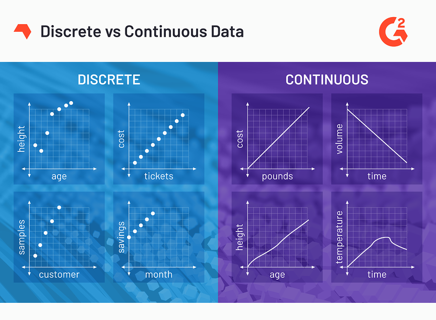

# Glossary

# Data Science

### **Discrete data**

**N**umerical type of data that includes whole, concrete numbers with specific and fixed data values.

### **Continuous data**

Complex numbers and varying data values that are measured over a particular time interval.

### **Discrete vs. Continuous**

### **Greedy**

A greedy algorithm is an algorithmic strategy that makes the best optimal choice at each small stage with the goal of this eventually leading to a globally optimum solution. This means that the algorithm picks the best solution at the moment without regard for consequences.

# Machine Learning

### **Reinforcement Learning**

Area of machine learning that is focused on training **agents** to take certain actions at certain **************states************** from within an **********************environment********************** to maximize ******rewards******.

### **Deep Q-net (DQN) model/algorithm**

DQN is a reinforcement learning algorithm where a deep learning model is built to find the actions an agent can take at each state.

### **Policy**

A policy is a mapping from environmental states to actions (typically denoted by $\pi$. An agent’s policy determines how it will act for a given sensory input (denoted as $\pi(s,a)$.

### **Dense layers**

Dense layers are neural layers that are densely, or fully connected. 

A dense layer is a layer that is deeply connected with its preceding layer, which means that the neurons of the layer are connected to every neuron of its preceding layer.

### [**Logits**](https://developers.google.com/machine-learning/glossary#logits)

Vector of raw (non-normalised) predictions that a classification model generates, which is ordinarily then passed to a normalisation function.

### [**log-odds**](https://developers.google.com/machine-learning/glossary#log-odds)

Logarithm of the odds of some event.

### [**Model**](https://developers.google.com/machine-learning/glossary#model)

Any mathematical construct that processes input data and returns output. Phrased differently, a model is the set of parameters and structure needed for a system to make predictions.

### **Gradient**

The ****************gradient**************** is a fancy word for derivative (**the rate of change of a function**). It is a directional vector that:

- Points in the direction of greatest increase of a function
- Is zero at a local maximum or local minimum

The term “gradient” is typically used for functions with several inputs and a single output (scalar field).

### **Loss function (or cost function)**

The **loss function** is the function that **computes the distance between the current output of the algorithm and the expected output**. It’s a method to evaluate how your algorithm models the data. It can be categorised into two groups. One for **classification** (discrete values, 0,1,2…) and the other for **regression** (continuous values).

### **Overfitting**

A gap between a training dataset accuracy and test dataset accuracy represents *overfitting*

*Overfitting* happens when a machine learning model performs worse on new, previously unseen inputs than it does on the training data. An overfitted model "memorises" the noise and details in the training dataset to a point where it negatively impacts the performance of the model on the new data.

### [**test set**](https://developers.google.com/machine-learning/glossary#test-set)

A subset of the dataset reserved for testing a trained model.

### [**validation set**](https://developers.google.com/machine-learning/glossary#validation-set)

The subset of the **dataset** that performs initial evaluation against a trained model.

### **Transduce (or transduction)**

***Dictionary Definition:*** To convert something, such as energy or a message, into another form or shape. This is a widespread term used in the domains of electronics and signal processing. In these fields, a "transducer" is a general term for components or modules that convert sounds to energy or vice versa.

# TensorFlow

TensorFlow is an end-to-end machine learning platform. It is an infrastructure layer for [differentiable programming](Glossary.md).

## [Differentiable programming](https://en.wikipedia.org/wiki/Differentiable_programming)

Programming paradigm in which a program can be [differentiated](https://en.wikipedia.org/wiki/Derivative) (*=process of finding a derivative*) throughout via [automatic differentiation](Glossary.md).

## [Automatic differentiation](https://en.wikipedia.org/wiki/Automatic_differentiation)

Set of techniques to evaluate the derivative of a function specified by a computer program.

# Keras

[https://keras.io/about/#about-keras](https://keras.io/about/#about-keras)

Keras is a deep learning API written in Python, running on top of the machine learning platform TensorFlow.

Keras is the high-level API of TensorFlow2: approachable, highly-productive interface for solving machine learning problems. It provides essential absstractions and building blocks for developing and shipping machine learning solutions with high iteration velocity.

## Models

- ************************************Sequential model:************************************ linear stack of layers.