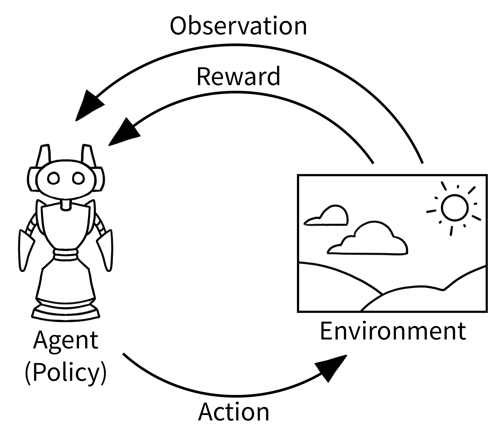

# Reinforcement Learning

[Double DQN](Double%20DQN.md)

**Definition**

Area of machine learning that is focused on training **agents** to take certain actions at certain **************states************** from within an **********************environment********************** to maximize ******rewards******.

**Technical Definitions**

The basic nomenclatures of RL include but are not limited to: **********************************current state (s)**********************************, ****************************state at the next step (s’)****************************, ********************action (a)********************, ********policy (p)********, and **********************reward (r).**********************

The **************************************state-action-value************************************** function (**************Q(s, a))************** is the expected total reward for an agent starting from the current state and the output of it is known as the **************Q value.**************

The goal of a RL is to maximise the reward (the Q value).

# Reward

## Definition

A **reward $R_t$** is a scalar feedback signal. (A scalar can be defined as a series of values).

The reward indicates how well the agent is doing at step **t**.

The agent’s job is to maximise cumulative reward.

### Examples

**Fly stunt manoeuvres in a helicopter**

- +ve reward for following the desired trajectory
- -ve reward for crashing

**Defeat the world champing at Backgammon**

- +/-ve reward for winning/losing a game

**Manage an investment portfolio**

- +ve reward for each $ in bank

**Control a power station**

- +ve reward for producing power
- -ve reward for exceeding safety thresholds

…

## Sequential Decision Making

The **goal is to select actions to maximise total future reward.**

Each actions may have long term consequences and the reward may be del ayed. As such, it may be better to sacrifice immediate reward to gain more long-term reward.

### Examples

- A financial investment (may take months to mature)
- Refueling a helicopter (might prevent a crash in several hours)
- Blocking opponent moves (might help winning chances many moves from now)

# Agent and environment

The agent is interacting within the environment. 

1. The Agent receives an observation of the current environmental state
2. The agent does action within this environment, according to the observation and its policy
3. The environment gives a reward to the agent according to the new state of the environment following its action
4. Back to 1…

# History and State

The **history** is the sequence of observations, action, rewards

$H_t=A_1,0_1,R_1,...,A_t,O_t,R_t$. All observable variables up to time **t.**

What happens next depends on the history:

- The agent selects action
- The environment selects observations/rewards

**********State********** is the information used to determine what happens next.

Formally, state is a function of the history:

$S_t=f(H_t)$

## Markov State (Information state)

An ************************************information state************************************ (a.k.a. ********Markov state)******** contains all useful information from the history.

**Definition**

A state $S_t$ is ************Markov************ if and only if $P[S_{t+1} | S_t] = P[S_{t+1}|S_1,...,S_t]$.

- “The future is independent of the past given the present”
- Once the state is known, the history may be thrown away (i.e. The state is a sufficient statistic of the future).
- The environment state $S^e_t$ is **Markov.**
- The History $H_t$ is ************Markov************. (The history is Markov because it contains all the necessary information of the current state, but it is not useful because these information are already stored in the current state).

Other things to explain here…

# Components of an RL Agent

An RL agent may include one or more of these components:

- **Policy**: agent’s behaviour function
- **Value function:** how good is each state and/or action
- **Model:** agent’s representation of the environment

## Policy

A **************policy************** is the agent’s behaviour. It is a map from state to action, e.g.: 

- Deterministic policy: $a=\pi(s)$
- Stochastic policy: $\pi(a|s)=P[A=a|S=s]$

$\pi$ is the symbol representing the **policy**.

## Value Function

Predictions of expected future reward. It is used to evaluate the goodness/badness of states and therefore, to select between actions, e.g.

$v_\pi(s)=E_\pi[R_t+\gamma R_{t+1}+\gamma^2 R_{t+2}+... | S_t=s]$

$\gamma$ (gamma) corresponds to the discount factor. The discount factor tells us how far ahead we are looking into the future. It basically means that the further we go into the future, the lower higher the discount factor will be and as such, will lower the future rewards.

The discount factor is present because we cannot indefinitely look into the future to take an action, otherwise, we will never take any action because it is infinite. And it is not necessarily useful to check that far ahead in the future, because other factors might change this expected future. So, the discount factor is important to lower the importance of future rewards.

### State Value Function (V)

kh

### Action Value Function (Q)

hg

### State-Action Value (Q-Value)

$Q_{t+1}(S_t,a_t)$

## Model

A **********model********** predicts what the environment will do next.

- ************************Transitions:************************ P predicts the next state (i.e. dynamics)
- ****************Rewards:**************** R predicts the next (immediate) reward, e.g.

The model is optional, it is not necessary to build a model, we can have a free model RL agent. But a model can be built if we want.

# Exploration vs. Exploitation

Following the principle of the value function and policy, why is the agent not always choosing the best action to gain more reward?

Indeed, taking an action that was previously said as being the “best” (when seeing the Q value table) is not necessarily the best one. It is a good action with what the agent know at the moment, but there is still some part of the environment not known by the agent. Those parts of the environment must be explored, and some of those newly explored parts can give the agent a lot more reward than what he knew before.

See this video: 

[Exploration vs. Exploitation - Learning the Optimal Reinforcement Learning Policy](https://youtu.be/mo96Nqlo1L8?list=PLZbbT5o_s2xoWNVdDudn51XM8lOuZ_Njv)

But how to choose between exploring or exploiting already known actions? We need a balance of exploration and exploitation to choose action, for this, we can use the **Epsilon-greedy strategy**. 

## Epsilon-greedy strategy

For this strategy, we define an exploration rate noted $\epsilon$ (epsilon), and we assign it a value of 1. $\epsilon=1$.

This is the probability that the agent will explore the agent rather than exploit it. With an $\epsilon=1$ it is 100% sure that the agent will explore the environment. As the agent learns more about the environment, at the start of each new episode, $\epsilon$ will start to decay by some rate that we set, so that the likelihood of exploration becomes less and less probable as the agent learn more and more about the environment.

The agent will become “**greedy**” in terms of exploiting the environment once it had the opportunity to explore it.

To determine whether an agent will choose exploration or exploitation at each time step, we generate a random number between 0 and 1. If this number is greater than epsilon then the agent will choose its next action via ************************exploitation************************ (with the highest Q-Value). Otherwise, it will choose its next action via exploration (randomly choose its action and see what happens in the environment).  

# Deep Q-net (DQN) model

********************Definition********************

DQN is a reinforcement learning algorithm where a deep learning model is built to find the actions an agent can take at each state.

**Technical Definitions**

DQN is a combination of deep learning and reinforcement learning. The model target is to approximate Q(s, a), and is updated through back propagation. 

Assuming the approximation of Q(s. a) is $\hat{y}$ (i.e., **y(hat)**) and the loss function is L, we have:

- prediction: $\hat{y}=f(s,\theta)$
- loss: $L(y,\hat{y})=L(Q(s,a),f(s,\theta))$

In the back propagation process we take the partial derivative of the loss function to $\theta$ to find a value of $\theta$ that minimises the loss.