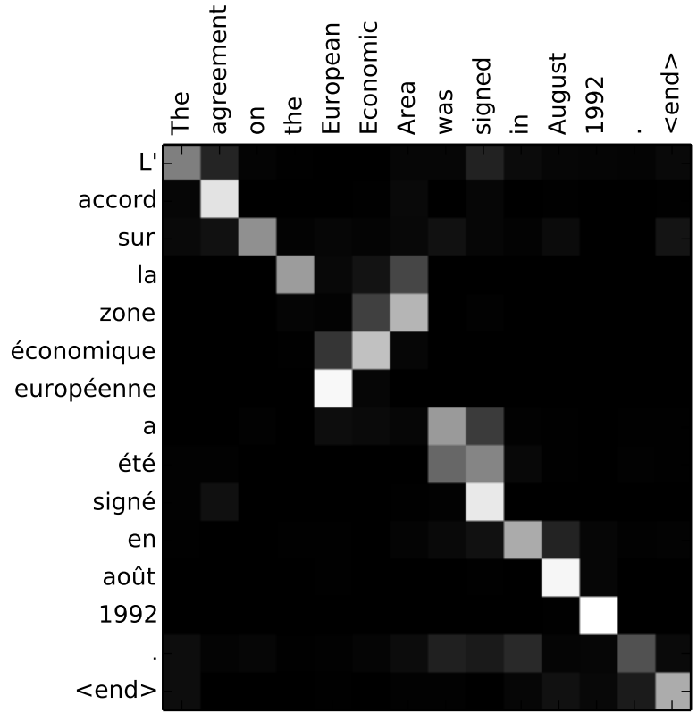
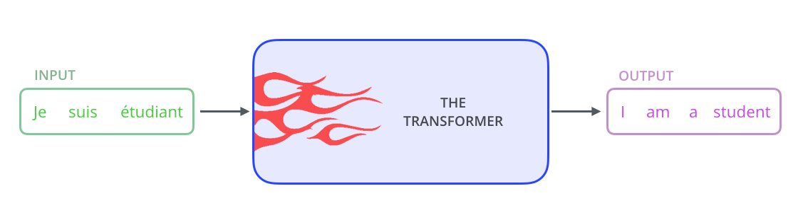
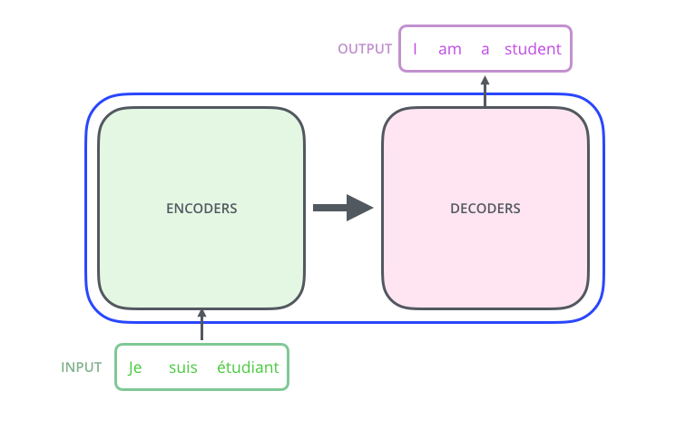
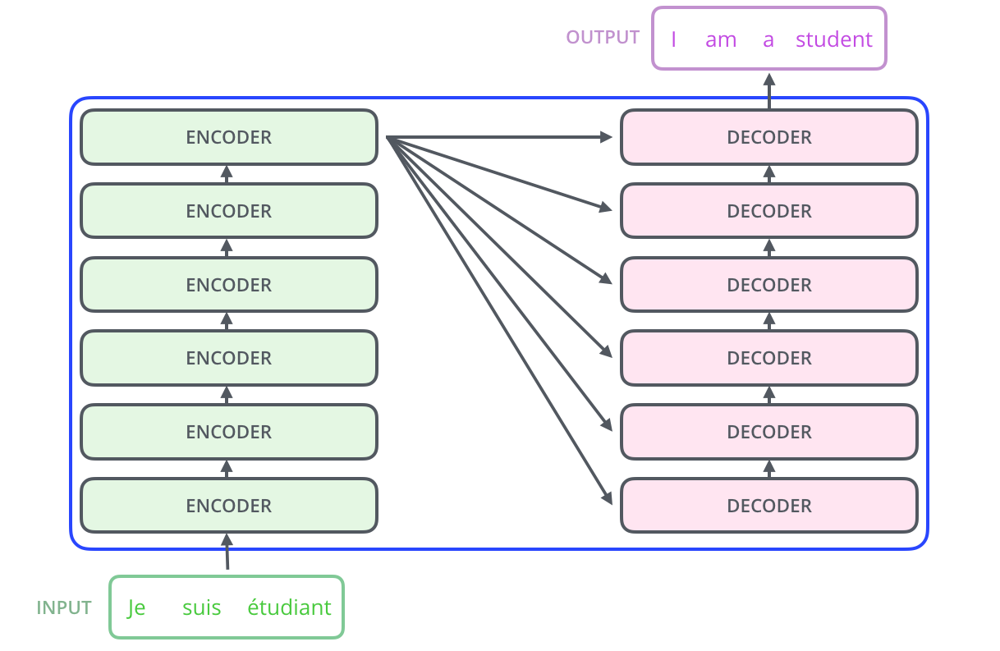
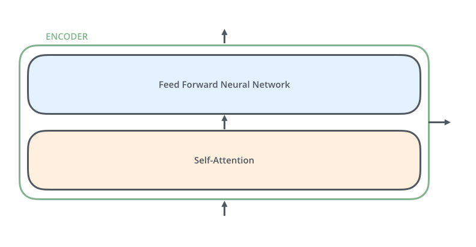
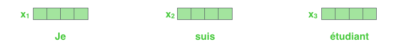
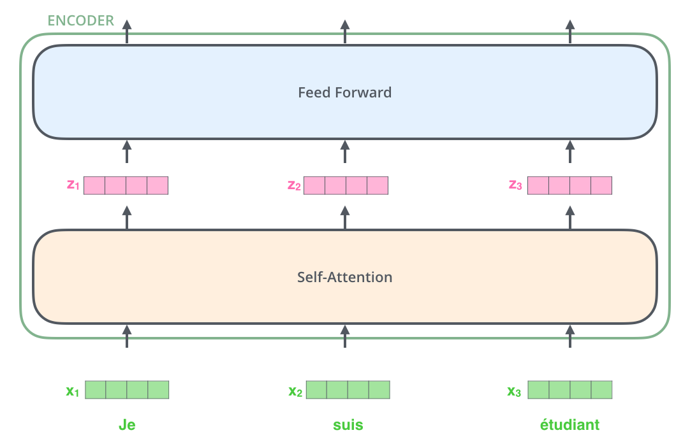
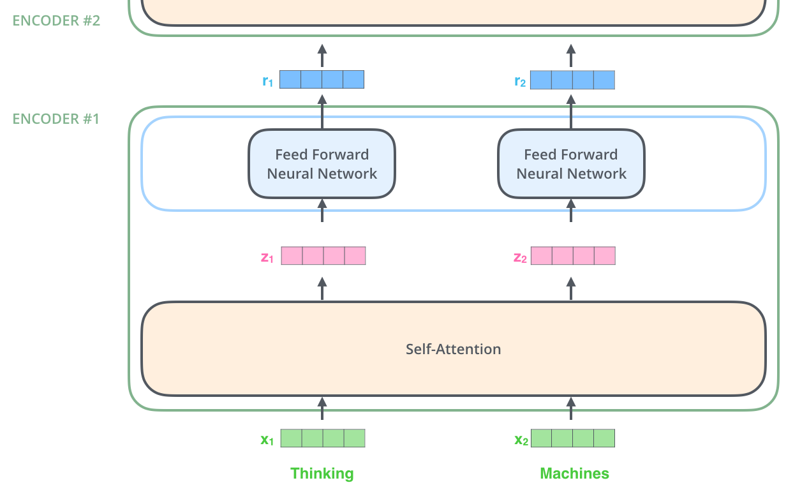
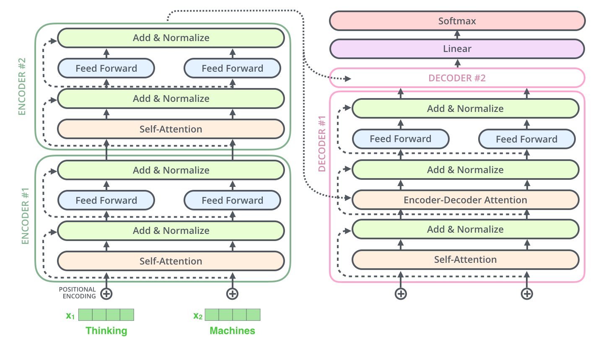

# Transformer

This document provides an introduction to the Transformer neural network architecture, which was introduced by Google engineers in 2017. The Transformer is a simpler network architecture based solely on attention mechanisms, dispensing with recurrence and convolutions entirely, and was aimed at solving Natural Language Processing tasks. The document explains why the Transformer was developed, how it works, and its architecture.

This page is more focused on the basic Transformer introduced for Natural Language Processing, but there are plenty of other model based on the this Transformer architecture.

# Introduction

Transformer is a type of neural network that has been introduced by Google Engineer in a famous paper called **************************************************Attention Is All You Need,************************************************** described by [Vaswani et al. (2017)](https://arxiv.org/abs/1706.03762v5). They aim at replacing the dominant sequence [transduction](../../Glossary%20d93e6a576fd34ba4864df0574f9ef209.md) models that are based on complex **RNN** or **CNN** that include an **encoder** and a **decoder** through an attention mechanism.

Transformer is a simpler network architecture that is based solely on attention mechanisms, dispensing with reccurrence and convolutions entirely, and was aimed at solving Natural Language Processing task.

Following the introduction of the Transformer architecture, researcher discovered many other use-cases for them, one of them being the Vision Transformer, which aims at applying transformer to Computer Vision task and as such, replacing basic convolution.

# Why Transformer? A little bit of history…

Before using Transformer, we were using **[Recurrent Neural Network](Recurent Neural Network.md)** (RNN). The problem with RNN is that when you give it a very long sentence, it cannot remember its beginning when it comes to the end of the sentence (that is because we are passing information in batch, and a single input can be splitted in multiple batch, so RNN can’t remember what was in the first passed batch). Also, because they rely on “recurrence”, they cannot be parallelised.

We then started to use **[Long Short-Term Memory](Long Short-Term Memory.md)** (LSTM), they are more sophisticated and are able to remember information for a longer time, but they take a ********very******** long time to train.

Then, apppeared **********************Transformer**********************, Transformer only relies on ****************************************self-attention**************************************** mechanism to remember thing, they do not have reccurence, and are then faster to train because they can be parallelised. Transformer was the first transduction model relying entirely on self-attention to compute representation of its input and output without using sequence-aligned RNNs or convolution (Vaswani et al., 2017).

# Attention mechanism (brief explanation)

## Attention

Attention is the ability for a model to pay attention to the important part of an input (sentences, images, …). The attention mechanism was introduced by [Bahdanau et al. (2014)](https://arxiv.org/abs/1409.0473) to address the bottleneck problem that arises with the use of a fixed-length encoding vector, where the decoder would have limited access to the information provided by the input.

Sample alignement found by RNNSearch-50 in an arbitrary sentence - Bahdanau et al. (2014)

The x-axis and y-axis
correspond to the words in the source sentence (English) and the generated translation (French),
respectively. Each pixel shows the weight $α_{ij}$ of the annotation of the j-th source word for the i-th
target word, in grayscale (0: black, 1: white).

In other word, the more white it is, the more the two corresponding words in the x and y-axis are related.

## Self-attention

> **Self-attention**, sometimes called intra-attention is an attention mechanism relating different positions of a single sequence in order to compute a representation of the sequence. Self-attention has been used successfully in a variety of tasks including reading comprehension, abstractive summarization, textual entailment and learning task-independent sentence representations 
    *— Vaswani et al., 2017.*
> 

In other word, self-attention is a way to relate difference positions of a single sequence in order to compute a representation of the sequence. In the below image, each word in the sentence have a certain relation with other word in this same sentence (e.g.: ********************************morning flight******************************** and ********the******** are related to each other, it defines ******the******).

](images/Transformer/Untitled 1.png)

Self-Attention in a single sentence - source: [https://vaclavkosar.com/ml/transformers-self-attention-mechanism-simplified](https://vaclavkosar.com/ml/transformers-self-attention-mechanism-simplified)

The most basic form of Transformer rely solely on self-attention, using a mechanism called ************************Multi-Head Attention************************ to counteract the reduced effectiveness in resolution using single **Self-Attention.**

See this about Self-Attention for Langugae Model: [http://jalammar.github.io/illustrated-transformer/#:~:text=Self-Attention at a High Level](http://jalammar.github.io/illustrated-transformer/#:~:text=Self%2DAttention%20at%20a%20High%20Level)

# Architecture as Language Model

This is part is heavily inspired by: [http://jalammar.github.io/illustrated-transformer/](http://jalammar.github.io/illustrated-transformer/)

<aside>
🔍 This part explain the Transformer architecture for a Transformer Language Model, the basic transformer type introduced by Google in 2017. It is not the only architecture of a Transformer as there is plenty other type of Transformer with a different architecture (but they are still based on the Attention mechanism).

</aside>

Tranformer can be though as a single black box. Taking the example of language translation, it would take a sentence in one language, and output its translation in another.

## Encoder & Decoder

We can break down this black box into two smaller “black” boxes, one being the **************************Encoder Stack************************** so the input goes into the **************Encoder**************, the **************Encoder************** then output its processig to the  **************************Decoder Stack**************************, emiting the output of words (or tokens).

The Encoder and Decoder stack are composed of layers (6 layers each in the initial Transformer, but this can be customised). The decoding stack is composed of the same number of layers as the encoding one. These two blocks (stack) are called ************************Transformer************************ blocks (*Transformer encoder block and transformer decoding block*).

<aside>
🔍 The initial transformer described in the original paper (and some other, like BERT) is a encoder-decoder model. However, **a Transformer is not necessarily an encoder-decoder model,** it is one of their possible architecture. Also, some model are more e*ncoder* focused or d*ecoder* focused, which means that either the encoder or decoder is doing most of the work.

</aside>

The encoders are all identical in structure (but do not share weights).

Each encoders are broken down into two sub-layers, the **Feed Forward Layer** (also called MLP), which is the output of the encoder, and, more importantly, the ****************************Self-Attention**************************** layer.

## Tokenisation

The sentence (input) passed to the model is broken down into token, this is called ************************tokenisation************************. Each word in the sentence are spliited and converted into number (ids). The id come from the model vocabulary (which can be represented as a gigantic list of word, and each of them with a unique id).

<aside>
🔍 Here, it is important to understand that a model is only able to see number, and perform calculation with them. A model never process any text.

</aside>

## Embeddings

Each token are being turned into a vector using an [embedding algorithm](https://medium.com/deeper-learning/glossary-of-deep-learning-word-embedding-f90c3cec34ca). They are converted into a vector of a fixed size (dimension of the model), which means now that each word are not represented by only one number, but by a vector of fixed dimension.

Each word is embedded into a vector of size 512. Represented with those boxes in this example.

The embedding only happens in the first encoder, which means that the first encoder receive a list of vectors each of the same size, but in the other encoders, it would be the output of the encoder that’s directly on top of it. So, after embedding the words, each of them flows through each of the two layers of the encoder (Feed Foward and Self-Attention).

## Encoding with Transformer blocks

We feed the encoders with the output of the embedding step. The Transformer work in parallel, so it can process multiple tokens at the same time in each encoder layers. This is what we call the Transformer block, what’s going on inside the encoders.

The blocks of transformer are not limited to only one block, we can stack a bunch of them together and feed each of them with the output of the previous block so the model is able to better capture the relationship between the data and give better results. These are called **hidden states**.

## Output Projection

Now, we need to turn each token back into languages (words). It’s called **Output Projection**. So we multiply each state by a matrix, which create a vector of the size of our vocabulary. So each value in the vector correspond to a word. It is a vector of logits, so each logit in the vector correspond to a score given to each output (the best output has higher score)

We need to convert each logit to a probability matrix, so we can use Softmax to do so because Softmax transform a vector into a probability vector adding up to 1, which is more usable